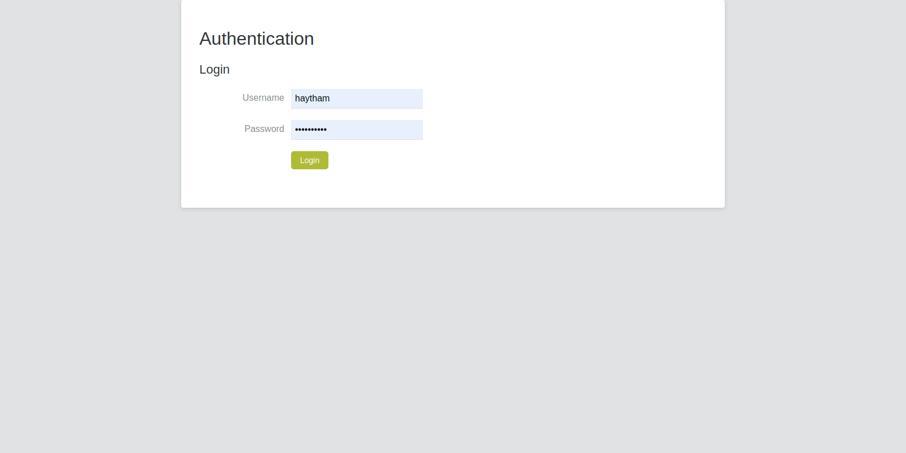
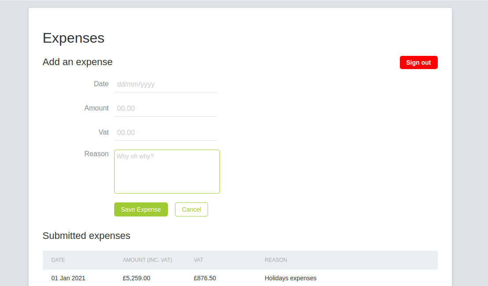

Expenses Saver Application
====
Web Application to save user expenses with VAT tax calculation.

Functionalities
--------------
> 1. Authenticate users (Token based authentication and authorization)
> 1. Save User Expense
> 0. Get user expenses
> 0. Calculate VAT Amount

Technologies
--------------
## Backend Service Based on the following technologies:
- Java 11
- Spring Boot Framework
- MySQL Database Server
## Front end client side:
- Typescript
- Angular Framework

How to run
--------------
## Spring Boot Configuration
```yaml
## Author: HAYTHAM DAHRI
spring:
  ## Application Name
  application:
    name: EXPENSES-REST
  ## Database Configuration
  datasource:
    url: jdbc:mysql://YOUE_HOST:3306/ENGAGETECHDB
    username: DATABASE_USERNAME
    password: DATABASE_PASSWORD
  jpa:
    show-sql: true
    hibernate:
      ddl-auto: update

## Vat Config
vat:
  percentage: 20

## Jwt Config
jwt:
  secret: sDSFjhhJH@__3546466-*/_--@@@888bsdfsdfsdf

## Currency API Uri
com:
  engage:
    currency:
      uri: https://api.exchangeratesapi.io
    ## Please change this based on frontend hostname or IP Address  
    allowed-origins: http://localhost:4200,http://localhost:3000
```
**Init System Users For Authentication:**
> **Username: ramzi**
>
> **Password: ramzi123**

> **Username: vedrana**
>
> **Password: vedrana123**

> **Username: jeanmichel**
>
> **Password: jeanmichel123**

> **Username: haytham**
>
> **Password: haytham123**


**Run Unit And Integration Tests:**
```bash
mvn clean test
```

**Run backend application:**
```bash
mvn spring-boot:run
```

## Angular Configuration (`Frontend-Application` folder)
Set Backend base endpoint `api` in the file `environments/environment.ts`
```javascript
export const environment = {
  production: false,
  api: 'http://localhost:8080'
};
```
Please install packages before running the application:
```bash
npm install --save
```
Run the application:
```bash
ng serve
```
Access the application with host and provide one of the users mentioned above to login (`INIT SYSTEM USERS`):
`http://MY_HOST:4200`

- **Login:** 
  - As a User, I can sign in using my email & password:


- **Expenses:** 
  - Expenses Page:


## Author
 - HAYTHAM DAHRI

**[Linkedin](https://www.linkedin.com/in/haytham-dahri/)** - **[Github](https://github.com/haythamdahri)** - **[Facebook](https://www.facebook.com/Haytham.dahri)**

***
Thank you for taking time to read the documentation.